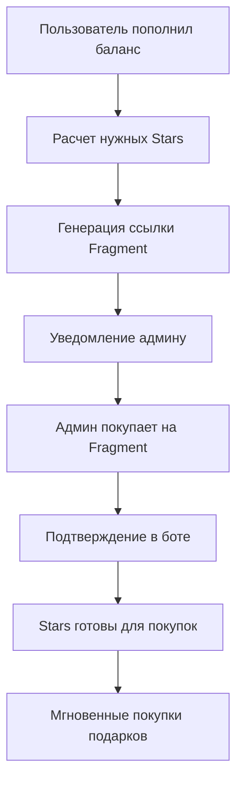

# 🚀 НОВАЯ ГИБРИДНАЯ СИСТЕМА TGGIFT BOT

## 🎯 Концепция разделения платежных систем

### Четкое разделение по назначению:
- **ЮКасса** 💳 → Только подписки (Basic/VIP)
- **TON кошелек** 💎 → Только пополнение баллов
- **Fragment.com** ⭐ → Автоматическая покупка Stars для депозитных аккаунтов

---

## 💳 ЮКАССА - ПОДПИСКИ

### Что работает через ЮКассу:
- ✅ Basic подписка - 699₽
- ✅ VIP подписка - 1299₽
- ✅ Оплата картой, СБП, Qiwi
- ✅ Автоматическая активация подписки

### Что НЕ работает через ЮКассу:
- ❌ Пополнение баллов (перенесено на TON)
- ❌ Покупка Stars (перенесено на Fragment)

```python
SUBSCRIPTION_CONFIGS = {
    'basic': {
        'price_rub': 699,           # Только рубли через ЮКассу
        'can_buy_points': False     # Basic не может покупать баллы
    },
    'vip': {
        'price_rub': 1299,          # Только рубли через ЮКассу  
        'can_buy_points': True,     # VIP может покупать баллы за TON
        'points_discount': 0.20     # 20% скидка на покупки
    }
}
```

---

## 💎 TON КОШЕЛЕК - ПОПОЛНЕНИЕ БАЛЛОВ

### Новая система баллов:
- **Курс**: 1 TON = 350 баллов
- **Минимум**: 0.3 TON
- **Максимум**: 100 TON
- **Только для VIP**: Basic пользователи не могут покупать баллы

### Бонусная система:
```python
TOPUP_BONUSES = {
    1000: 0.0,       # До 1000 баллов - без бонуса
    5000: 0.05,      # 1000-5000 баллов - бонус 5%
    10000: 0.10,     # 5000-10000 баллов - бонус 10%
    50000: 0.15      # Свыше 10000 баллов - бонус 15%
}
```

### Пример расчета:
```
Пользователь пополняет на 10 TON:
- Базовые баллы: 10 × 350 = 3,500 баллов
- Бонус: 5% = 175 баллов
- Итого: 3,675 баллов
```

---

## ⭐ FRAGMENT.COM - ПОКУПКА STARS

### Автоматическая система:
1. **Мониторинг баланса** депозитных аккаунтов
2. **Расчет оптимальных пакетов** при нехватке Stars
3. **Уведомление админу** с готовой ссылкой
4. **Подтверждение покупки** через команды бота

### Пакеты Fragment:
```python
FRAGMENT_PACKAGES = {
    50: {'ton': 0.2301, 'usd': 0.75},
    75: {'ton': 0.3452, 'usd': 1.12}, 
    100: {'ton': 0.4603, 'usd': 1.50},
    150: {'ton': 0.6905, 'usd': 2.25},
    250: {'ton': 1.1508, 'usd': 3.75},
    350: {'ton': 1.611, 'usd': 5.25}
}
```

### Экономия по сравнению с Telegram:
- **Fragment**: ~$0.015 за 1⭐ 
- **Telegram**: ~$0.02 за 1⭐
- **Экономия**: ~25%

---

## 🔄 АЛГОРИТМ РАБОТЫ СИСТЕМЫ

### 1. Пользователь покупает VIP подписку
```
Пользователь → ЮКасса (1299₽) → Активация VIP → Доступ к покупке баллов
```

### 2. Пополнение баллов
```
VIP пользователь → TON кошелек → Конвертация в баллы → Доступны для автопокупки
```

### 3. Автопокупка подарков
```
Новый подарок → Мгновенная проверка Stars → Мгновенная покупка
(Stars уже куплены при пополнении баланса пользователем)
```

### 4. Fragment интеграция (новая логика)


---

## 🛠️ ТЕХНИЧЕСКИЕ ДЕТАЛИ

### Новые классы:
- **`FragmentStarsManager`** - управление покупками Stars
- **Обновленный `DepositAccountsManager`** - интеграция с Fragment
- **Модифицированные платежные системы** - четкое разделение

### Новые команды для админа:
- `/pending_stars` - показать ожидающие покупки
- `/confirm_stars_ID` - подтвердить покупку
- `/cancel_stars_ID` - отменить покупку

### Настройки окружения:
```bash
# Депозитные аккаунты (обновлено)
DEPOSIT_ACCOUNT_1_API_ID=...
DEPOSIT_ACCOUNT_1_API_HASH=...
DEPOSIT_ACCOUNT_1_PHONE=...
DEPOSIT_ACCOUNT_1_USERNAME=...  # Новое поле!

# TON кошелек для баллов
TON_WALLET_ADDRESS=...

# ЮКасса только для подписок
YOOKASSA_SHOP_ID=...
YOOKASSA_SECRET_KEY=...
```

---

## 📊 ПРЕИМУЩЕСТВА НОВОЙ СИСТЕМЫ

### 🎯 Для пользователей:
- **Простота**: четкое разделение - подписки через карту, баллы через TON
- **Экономия**: Fragment дешевле на 25%
- **Прозрачность**: понятные курсы и бонусы

### 🔧 Для администрации:
- **Автоматизация**: минимум ручной работы
- **Контроль**: полный контроль над экономикой
- **Масштабируемость**: легко добавить новые способы оплаты

### 💰 Для бизнеса:
- **Снижение затрат**: экономия 25% на Stars
- **Увеличение конверсии**: удобные способы оплаты
- **Гибкость**: возможность быстро менять курсы и бонусы

---

## 🚀 ПЛАН РАЗВЕРТЫВАНИЯ

### Этап 1: Подготовка
- [x] Обновить конфигурацию
- [x] Создать `FragmentStarsManager`
- [x] Обновить `DepositAccountsManager`
- [x] Модифицировать интерфейс пополнения

### Этап 2: Тестирование
- [ ] Тестировать покупку подписок через ЮКассу
- [ ] Тестировать пополнение баллов через TON
- [ ] Тестировать автопокупку Stars через Fragment

### Этап 3: Развертывание
- [ ] Миграция пользователей
- [ ] Обновление документации
- [ ] Мониторинг системы

---

## ⚠️ ВАЖНЫЕ ЗАМЕЧАНИЯ

### Безопасность:
- Fragment покупки требуют подтверждения админа
- Все транзакции логируются
- Максимальные лимиты на пополнение

### Совместимость:
- Старые балансы пользователей сохраняются
- Постепенный переход на новую систему
- Поддержка обеих систем в переходный период

### Мониторинг:
- Логирование всех операций Fragment
- Уведомления о критических ошибках
- Регулярные проверки балансов депозитных аккаунтов 