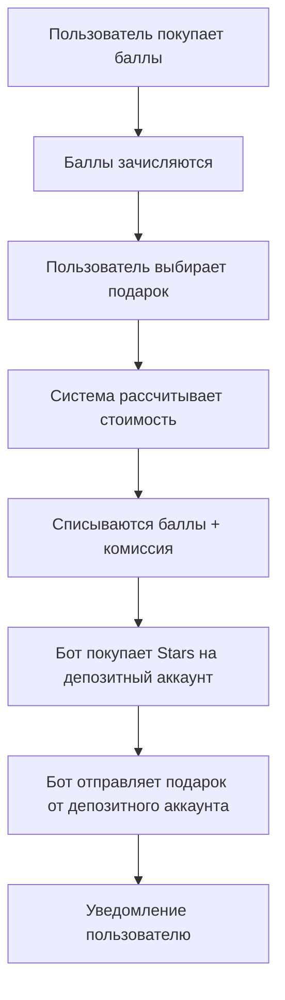

# 🎁 СХЕМА ПОКУПКИ ПОДАРКОВ БОТОМ

## 🎯 Основная Проблема
**Вопрос:** За чей счет бот покупает подарки пользователям?

**Варианты решения:**
1. **Ваш личный аккаунт** - бот покупает от вашего имени
2. **Аккаунты пользователей** - бот получает доступ к их аккаунтам
3. **Гибридная система** - комбинация обоих подходов

## 💡 Рекомендуемая Схема: ГИБРИДНАЯ СИСТЕМА

### Вариант 1: Бот покупает от ВАШЕГО аккаунта
```
Пользователь платит баллы → Бот покупает подарок с вашего Telegram → Отправляет получателю
```

**Преимущества:**
- ✅ Простота реализации
- ✅ Полный контроль процесса
- ✅ Не нужны права доступа к аккаунтам пользователей

**Недостатки:**
- ❌ Все подарки идут от одного аккаунта (вашего)
- ❌ Нужен большой баланс Stars на вашем аккаунте
- ❌ Ограничения Telegram на количество подарков в день

### Вариант 2: Бот управляет аккаунтами пользователей
```
Пользователь дает доступ → Пополняет баланс → Бот покупает от его имени → Отправляет подарок
```

**Преимущества:**
- ✅ Подарки идут от реального отправителя
- ✅ Нет ограничений на ваш аккаунт
- ✅ Более естественно для получателей

**Недостатки:**
- ❌ Сложная авторизация через MTProto
- ❌ Пользователи должны доверить боту свой аккаунт
- ❌ Юридические риски

## 🎯 ОПТИМАЛЬНОЕ РЕШЕНИЕ

### Схема "Депозитный Аккаунт + Автоматизация"



### Детальная Схема:

#### 1. **Депозитный Аккаунт**
```python
# Создаем специальный Telegram аккаунт для покупок
GIFT_BUYER_ACCOUNT = {
    "phone": "+7XXXXXXXXX",  # Отдельный номер
    "name": "TgGift Bot Assistant",
    "purpose": "Автоматические покупки подарков"
}

# Этот аккаунт будет:
# - Покупать Stars через ЮКассу/TON
# - Отправлять подарки пользователям
# - Вести учет всех транзакций
```

#### 2. **Экономическая Модель**
```python
# Пример расчета для подарка стоимостью 100 Stars:

GIFT_ECONOMICS = {
    "gift_cost_stars": 100,        # Стоимость в Telegram
    "star_rub_rate": 2.0,          # 1 Star = 2 рубля
    "gift_cost_rub": 200,          # 100 * 2 = 200₽
    "our_commission": 0.15,        # Наша комиссия 15%
    "user_pays_rub": 230,          # 200 + 15% = 230₽
    "user_pays_points": 230        # 230 баллов
}

# Схема расчета:
def calculate_gift_price(stars_cost: int) -> dict:
    """Расчет цены подарка для пользователя"""
    # Стоимость в рублях (по курсу Stars)
    rub_cost = stars_cost * STAR_TO_RUB_RATE
    
    # Наша комиссия
    commission = rub_cost * OUR_COMMISSION_RATE
    
    # Итоговая цена для пользователя
    user_price_rub = rub_cost + commission
    user_price_points = int(user_price_rub)  # 1 балл = 1 рубль
    
    return {
        "stars_cost": stars_cost,
        "base_cost_rub": rub_cost,
        "commission_rub": commission,
        "user_pays_rub": user_price_rub,
        "user_pays_points": user_price_points
    }
```

#### 3. **Процесс Покупки Подарка**
```python
async def process_gift_purchase(user_id: int, gift_id: str, recipient_id: int):
    """Полный процесс покупки подарка"""
    
    # 1. Получаем информацию о подарке
    gift_info = await get_telegram_gift_info(gift_id)
    stars_cost = gift_info['stars_cost']
    
    # 2. Рассчитываем цену для пользователя
    pricing = calculate_gift_price(stars_cost)
    user_price_points = pricing['user_pays_points']
    
    # 3. Проверяем баланс пользователя
    user_balance = db_manager.get_points_balance(user_id)
    if user_balance < user_price_points:
        return {"success": False, "error": "insufficient_balance"}
    
    # 4. Резервируем баллы (блокируем на время покупки)
    transaction_id = db_manager.reserve_points(user_id, user_price_points, f"Gift {gift_id}")
    
    try:
        # 5. Покупаем Stars на депозитный аккаунт (если нужно)
        await ensure_stars_balance(stars_cost)
        
        # 6. Отправляем подарок через депозитный аккаунт
        gift_result = await send_gift_via_deposit_account(gift_id, recipient_id)
        
        if gift_result['success']:
            # 7. Подтверждаем списание баллов
            db_manager.confirm_points_transaction(transaction_id)
            
            # 8. Записываем успешную покупку
            db_manager.record_gift_purchase(
                user_id=user_id,
                recipient_id=recipient_id,
                gift_id=gift_id,
                points_spent=user_price_points,
                stars_spent=stars_cost,
                commission=pricing['commission_rub'],
                telegram_gift_id=gift_result['gift_message_id']
            )
            
            return {"success": True, "gift_id": gift_result['gift_message_id']}
        else:
            # 8. Отменяем резервирование при ошибке
            db_manager.cancel_points_reservation(transaction_id)
            return {"success": False, "error": gift_result['error']}
            
    except Exception as e:
        # Отменяем резервирование при любой ошибке
        db_manager.cancel_points_reservation(transaction_id)
        logger.error(f"Ошибка покупки подарка: {e}")
        return {"success": False, "error": str(e)}
```

#### 4. **Управление Балансом Stars**
```python
class StarsBalanceManager:
    """Управление балансом Stars на депозитном аккаунте"""
    
    def __init__(self):
        self.min_stars_balance = 1000  # Минимальный остаток
        self.topup_amount = 5000       # Сумма пополнения
    
    async def ensure_stars_balance(self, required_stars: int):
        """Обеспечиваем достаточный баланс Stars"""
        current_balance = await self.get_current_stars_balance()
        
        if current_balance < required_stars + self.min_stars_balance:
            # Нужно пополнить
            topup_needed = self.topup_amount
            await self.topup_stars_balance(topup_needed)
    
    async def topup_stars_balance(self, amount: int):
        """Пополнение Stars через ЮКассу"""
        # Создаем платеж в ЮКассе на покупку Stars
        payment_data = {
            "amount": amount * STAR_TO_RUB_RATE,  # Конвертируем в рубли
            "currency": "RUB",
            "description": f"Пополнение Stars для подарков: {amount}",
            "metadata": {
                "type": "stars_topup",
                "stars_amount": amount,
                "account": "deposit"
            }
        }
        
        payment = await yookassa_client.create_payment(payment_data)
        
        # Автоматически оплачиваем (если настроена автооплата)
        # Или отправляем уведомление админу для оплаты
        await self.notify_admin_topup_needed(payment['payment_url'], amount)
    
    async def get_current_stars_balance(self) -> int:
        """Получение текущего баланса Stars"""
        # Через MTProto API или веб-скрапинг
        # Возвращает количество Stars на депозитном аккаунте
        pass
```

#### 5. **База Данных для Подарков**
```sql
-- Таблица покупок подарков
CREATE TABLE IF NOT EXISTS gift_purchases (
    id INTEGER PRIMARY KEY AUTOINCREMENT,
    user_id INTEGER NOT NULL,
    recipient_id INTEGER,
    gift_type TEXT NOT NULL,
    gift_telegram_id TEXT,
    points_spent INTEGER NOT NULL,
    stars_spent INTEGER NOT NULL,
    commission_rub REAL NOT NULL,
    status TEXT DEFAULT 'completed', -- 'pending', 'completed', 'failed', 'refunded'
    created_at TIMESTAMP DEFAULT CURRENT_TIMESTAMP,
    FOREIGN KEY (user_id) REFERENCES users(user_id)
);

-- Таблица баланса Stars на депозитных аккаунтах
CREATE TABLE IF NOT EXISTS stars_balance_log (
    id INTEGER PRIMARY KEY AUTOINCREMENT,
    account_name TEXT NOT NULL,
    balance_before INTEGER,
    balance_after INTEGER,
    operation TEXT, -- 'topup', 'spend', 'check'
    amount INTEGER,
    description TEXT,
    created_at TIMESTAMP DEFAULT CURRENT_TIMESTAMP
);

-- Таблица резервирования баллов
CREATE TABLE IF NOT EXISTS points_reservations (
    id INTEGER PRIMARY KEY AUTOINCREMENT,
    user_id INTEGER NOT NULL,
    points_amount INTEGER NOT NULL,
    purpose TEXT NOT NULL,
    status TEXT DEFAULT 'active', -- 'active', 'confirmed', 'cancelled'
    expires_at TIMESTAMP,
    created_at TIMESTAMP DEFAULT CURRENT_TIMESTAMP
);
```

## 💰 Экономика и Прибыльность

### Расчет Прибыли:
```python
# Пример на месяц:
MONTHLY_STATS = {
    "gifts_sold": 1000,           # 1000 подарков в месяц
    "avg_gift_cost_stars": 150,   # Средняя стоимость 150 Stars
    "avg_gift_cost_rub": 300,     # 150 * 2₽ = 300₽
    "commission_rate": 0.15,      # 15% комиссия
    "commission_per_gift": 45,    # 300₽ * 15% = 45₽
    
    "monthly_revenue": 45000,     # 1000 * 45₽ = 45,000₽
    "monthly_costs": 5000,        # Сервер, депозитный аккаунт и тд
    "monthly_profit": 40000       # 45,000₽ - 5,000₽ = 40,000₽
}
```

### Автоматическое Пополнение:
```python
# Настройки автопополнения
AUTO_TOPUP_CONFIG = {
    "enabled": True,
    "min_balance_threshold": 1000,    # Пополнять при балансе < 1000 Stars
    "topup_amount": 5000,             # Пополнять на 5000 Stars
    "max_daily_topup": 20000,         # Максимум 20000 Stars в день
    "payment_method": "yookassa",     # Способ пополнения
    "notify_admin": True              # Уведомлять админа о пополнениях
}
```

## 🎯 Преимущества Этой Схемы:

1. **Полный Контроль**
   - Вы контролируете весь процесс
   - Прозрачная экономика
   - Легко масштабировать

2. **Автоматизация**
   - Автоматическое пополнение Stars
   - Автоматические покупки подарков
   - Минимальное участие админа

3. **Прибыльность**
   - Четкая комиссионная модель
   - Предсказуемая прибыль
   - Возможность менять комиссию

4. **Надежность**
   - Резервирование баллов
   - Откат при ошибках
   - Полная история операций

5. **Масштабируемость**
   - Можно добавить несколько депозитных аккаунтов
   - Распределение нагрузки
   - Географическое распределение

## 🚀 План Внедрения:

**Этап 1 (1 день):**
- Создать депозитный Telegram аккаунт
- Настроить MTProto API для работы с ним
- Создать таблицы для подарков

**Этап 2 (1 день):**
- Интегрировать систему резервирования баллов
- Создать механизм автопополнения Stars
- Протестировать покупку подарков

**Результат:**
- Полностью автоматизированная система подарков
- Стабильный доход с каждой покупки
- Минимальные операционные затраты

Что думаете об этой схеме? Готов детализировать любую часть! 